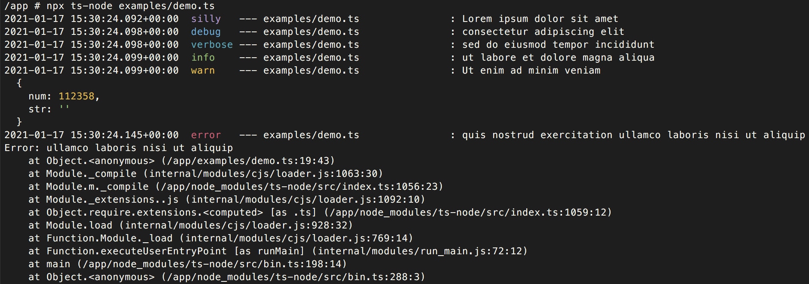

winston-format-console-ootb
=============================

Winston formatter for console output out-of-the-box.

Features
--------

- Preconfigured for console output.
    - Timestamp w/ time offset.
    - Colorized log level.
    - Stack trace if `Error` object is passed.
    - Pretty-printing of the meta object.
- Log name of the source file.
    - You need to pass `NodeModule` object to `prettyConsole()` and create a `winston.Logger` object for each source file.

Install
-------

```bash
# You need to explicitly install winston.
npm install \
  winston \
  winston-format-console-ootb
```

Demo
----

```typescript
import winston from 'winston';
import { prettyConsole } from 'winston-format-console-ootb';

const logger = winston.createLogger({
  level: 'silly',
  format: winston.format.errors({ stack: true }),
  transports: [
    new winston.transports.Console({
      format: prettyConsole(winston.config.npm.levels, module),
    }),
  ],
});

logger.silly('Lorem ipsum dolor sit amet');
logger.debug('consectetur adipiscing elit');
logger.verbose('sed do eiusmod tempor incididunt');
logger.info('ut labore et %s', 'dolore magna aliqua'); // use splat
logger.warn('Ut enim ad minim veniam', { num: 112358, str: '' }); // pass meta
logger.error('quis nostrud exercitation', new Error('ullamco laboris nisi ut aliquip')); // pass Error object
```


